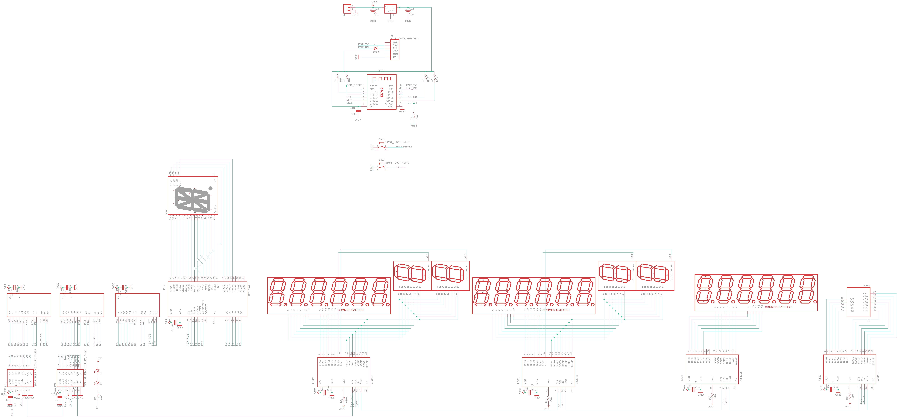
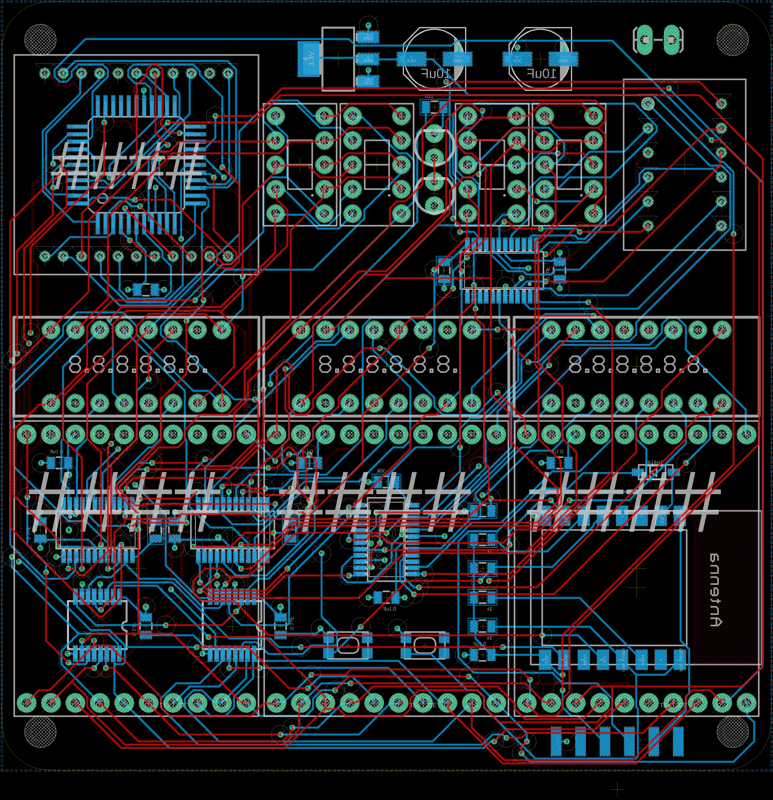

# code-red
A bunch of cool displays thrown together

I was digging through my pile of spare parts and found a few displays I wanted to get up and running.

The simple board just arranges them all in a pleasing way. I have had some success getting them through their entire character set, but need to think about how to serialize the data for all these different devices...

